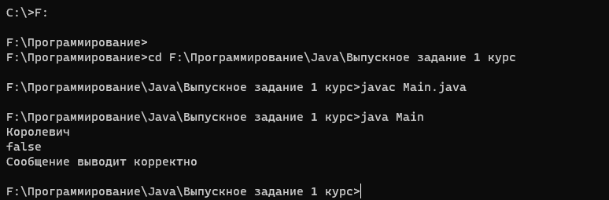

# Java в командной строке
---
## Задание:
### Пример кода для проверки
```
import java.util.Scanner;
public class Main {
    static boolean Included(String s1, String s2) {
        for (int x = 0; x < s1.length(); x++) {
            for (int y = 0; (x + y) < s1.length() && y < s2.length(); y++) {
                if (s1.charAt(x + y) != s2.charAt(y)) break;
                if (y == s2.length() - 1)
                    return true; // условие, когда подстрока является частью строки
            }
        }
        return false;
    }

    public static void main(String[] args) {

        Scanner keyboard = new Scanner(System.in);
        String W1 = keyboard.nextLine();
        String W2 = "Артур";
        boolean N = Included(W1, W2);
        System.out.println(N);
        System.out.println("Сообщение выводит корректно");
    }
}
```
### Результат в консоли

